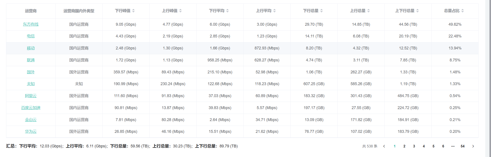
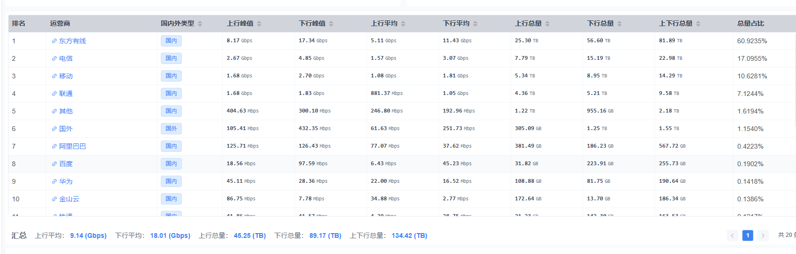

查询时间：2026-04-15 00:00- 2026-04-15 10:58 （两者一样）
查询链路：1条链路

### v1版本呈现

汇总：下行平均：12.03 (Gbps)；上行平均：6.11 (Gbps)；下行总量：59.56 (TB)；上行总量：30.23 (TB)；上下行总量：89.79 (TB)

接口代码入口：D:\code\fcas-java-v1\webapp-fcas-latest\src\main\java\com\marfosec\modules\traffic\controller\DwsIspController.java

### v2版本呈现

汇总

上行平均： 9.14 (Gbps)

下行平均： 18.01 (Gbps)

上行总量： 45.25 (TB)

下行总量： 89.17 (TB)

上下行总量： 134.42 (TB)

接口代码入口：D:\code\fcas-go-v2\server\api\v1\traffic\isp_traffic.go

### 问题：究竟是什么导致两者在一样的查询条件下查出了不同的结果，v2的查询普遍偏大。

